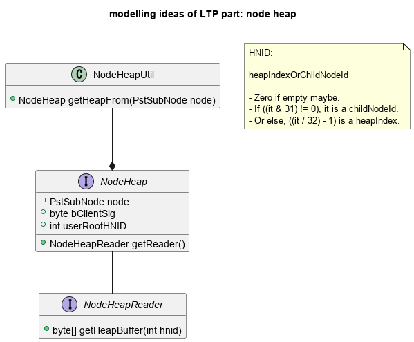
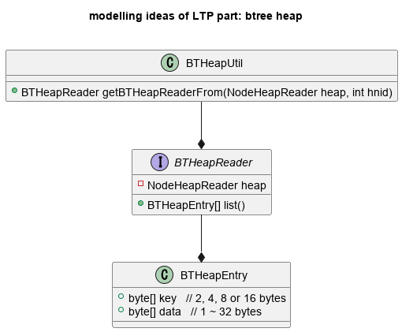
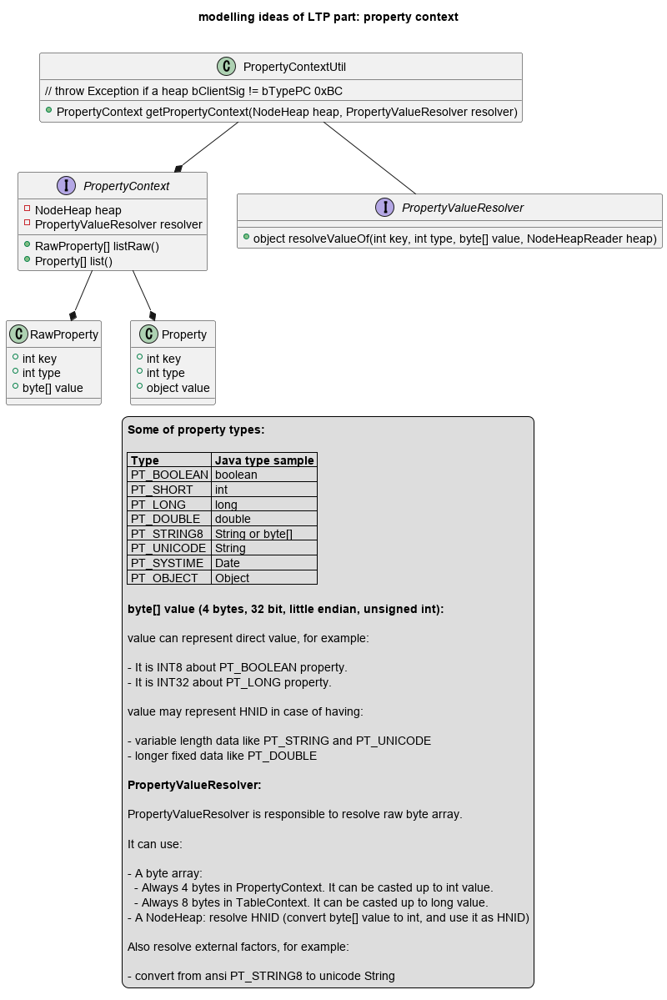
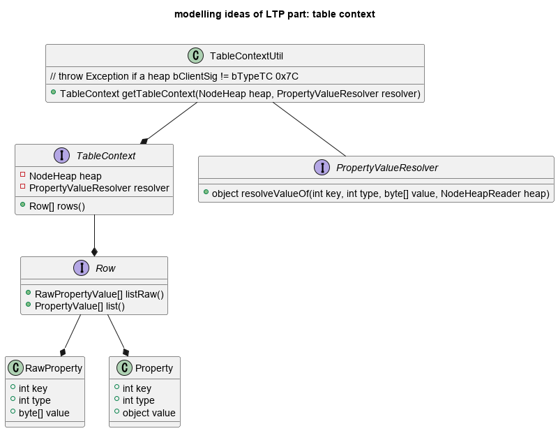

# ruby-msg-nx

[](https://dev.azure.com/HiraokaHyperTools/ruby-msg/_build/latest?definitionId=12&branchName=dev)
[](https://rubygems.org/gems/ruby-msg-nx)

_Quick links_: [Home](https://hiraokahypertools.github.io/ruby-msg/) | [yard](https://hiraokahypertools.github.io/ruby-msg/doc/index.html)

This is a private fork of https://github.com/aquasync/ruby-msg repository.

## Birds eye view of PST file structure


Notes:

- `nodeId` in PstStore/PstNode is unique number in pst file.
  - There are some known `nodeId`s from Outlook. For example `290` is useful to obtain top_node in both pst and ost file.
- PstNode consists from tree structure. 
  - There is zero or one parent.
  - There are zero, one or many children.
  - There may be one or some root nodes (having no parent).
- `PstNode` is application unaware structure.
  - Outlook uses pst and ost to store mail folders and items like mail, contact and so on.
  - getData() returns contents corresponding to `NID_TYPE_`. See `NID_TYPE_` section.
  - Each `byte[]` length ranges from 0 to 8176. It cannot exceed 8176 bytes. This comes from PST limitation.
- `is4K` is Outlook specific.
  - is4K is applied to OST file, not PST file.
  - Usually block size is 512 bytes.
  - 4k file uses 4,096 bytes per block.
  - And also multiply page index part by 8.
  - The page index is about node heap.

### PstNode sample structure

This is a sample structure starting from a PstNode. Each `SL#` means it is a SLBlock entry. The indent shows that it is child PstSubNode.

```
PstNode nodeId:0x2001c4 nidType:0x04 (NID_TYPE_NORMAL_MESSAGE)
  SL#0 nodeId:0x0671 nidType:0x11 (NID_TYPE_ATTACHMENT_TABLE)
  SL#1 nodeId:0x80e5 nidType:0x05 (NID_TYPE_ATTACHMENT)
    SL#0 nodeId:0x82df nidType:0x1f (NID_TYPE_LTP)
    SL#1 nodeId:0x82ff nidType:0x1f (NID_TYPE_LTP)
  SL#2 nodeId:0x82bf nidType:0x1f (NID_TYPE_LTP)
```

The primary node `PstNode nodeId:0x2001c4 nidType:0x04 (NID_TYPE_NORMAL_MESSAGE)
` stores RawPropertyStore (PropertyContext in msft document):

- RawProperty format is `{(key and type), value)}`.
- For example `{(001a001f), IPM.Note)}` means:
  - propertyId = _0x001a_
  - dataType = _0x001f_ (PT_UNICODE)
  - This is _PidTagMessageClass_. See also: [PidTagMessageClass Canonical Property | Microsoft Docs](https://docs.microsoft.com/en-us/office/client-developer/outlook/mapi/pidtagmessageclass-canonical-property)
  - value = `IPM.Note`

See also:

- [[MS-PST]: Property Context (PC) | Microsoft Docs](https://docs.microsoft.com/en-us/openspecs/office_file_formats/ms-pst/294c83c6-ff92-42f5-b6b6-876c29fa9737)

### RawPropertyStore sample

RawPropertyStore stores a set of properties.

```
{(0002000b), True)}
{(00170003), 1)}
{(001a001f), IPM.Note)}
{(0023000b), False)}
{(00260003), 0)}
{(0029000b), False)}
{(00360003), 0)}
{(0037001f), PDFs)}
{(0070001f), PDFs)}
{(00710102), System.Byte[])}
{(0e01000b), False)}
{(0e060040), System.Byte[])}
{(0e070003), 25)}
{(0e080003), 6361419)}
{(1000001f), 「日本型食生活」のススメ)}
{(10130102), System.Byte[])}
{(10800003), 4294967295)}
{(30070040), System.Byte[])}
{(30080040), System.Byte[])}
{(300b0102), System.Byte[])}
{(3fde0003), 50220)}
{(3ff10003), 1041)}
{(6619001f), 「日本型食生活」のススメ)}
{(80100003), 0)}
{(8016000b), False)}
{(80210003), 155399)}
{(8049001f), 15.0)}
{(804a000b), False)}
{(804b0003), 0)}
{(8053000b), False)}
{(80560003), 0)}
{(80900040), System.Byte[])}
{(80930102), System.Byte[])}
{(80940102), System.Byte[])}
{(80b00003), 1041)}
```

### The secondary node usage

- subNode `0x671` must exist, if the message has one or more _attachment files_. See also: [[MS-PST]: Attachment Table Template | Microsoft Docs](https://docs.microsoft.com/en-us/openspecs/office_file_formats/ms-pst/47c336f7-2d9b-4f22-91c7-5bb422aaebbb)
- subNode `0x692` must exist, if the message has one or more _recipient entries_. See also: [[MS-PST]: Recipient Table Template | Microsoft Docs](https://docs.microsoft.com/en-us/openspecs/office_file_formats/ms-pst/bb069b2b-80ad-46d5-b86f-33487d16bf0c)

### Embedded messages

This is a sample having depth of 4 embedded message.

```txt
┌ Alpha
└┬ Beta
 └┬ Gamma
  └─ Delta
```

This shows that `NID_TYPE_NORMAL_MESSAGE` of embedded messages appear in deeper hierarchy.

```txt
PstNode nodeId:0x2097188 nidType:0x04 (NID_TYPE_NORMAL_MESSAGE)
  SL#0 nodeId:0x0671 nidType:0x11 (NID_TYPE_ATTACHMENT_TABLE)
  SL#1 nodeId:0x8025 nidType:0x05 (NID_TYPE_ATTACHMENT)
    SL#0 nodeId:0x803f nidType:0x1f (NID_TYPE_LTP)
  SL#2 nodeId:0x8045 nidType:0x05 (NID_TYPE_ATTACHMENT)
    SL#0 nodeId:0x80ff nidType:0x1f (NID_TYPE_LTP)
    SL#1 nodeId:0x200044 nidType:0x04 (NID_TYPE_NORMAL_MESSAGE)
      SL#0 nodeId:0x0671 nidType:0x11 (NID_TYPE_ATTACHMENT_TABLE)
      SL#1 nodeId:0x8065 nidType:0x05 (NID_TYPE_ATTACHMENT)
        SL#0 nodeId:0x805f nidType:0x1f (NID_TYPE_LTP)
      SL#2 nodeId:0x8085 nidType:0x05 (NID_TYPE_ATTACHMENT)
        SL#0 nodeId:0x80df nidType:0x1f (NID_TYPE_LTP)
        SL#1 nodeId:0x200064 nidType:0x04 (NID_TYPE_NORMAL_MESSAGE)
          SL#0 nodeId:0x0671 nidType:0x11 (NID_TYPE_ATTACHMENT_TABLE)
          SL#1 nodeId:0x80a5 nidType:0x05 (NID_TYPE_ATTACHMENT)
            SL#0 nodeId:0x807f nidType:0x1f (NID_TYPE_LTP)
          SL#2 nodeId:0x80c5 nidType:0x05 (NID_TYPE_ATTACHMENT)
            SL#0 nodeId:0x80bf nidType:0x1f (NID_TYPE_LTP)
            SL#1 nodeId:0x200084 nidType:0x04 (NID_TYPE_NORMAL_MESSAGE)
              SL#0 nodeId:0x0671 nidType:0x11 (NID_TYPE_ATTACHMENT_TABLE)
              SL#1 nodeId:0x80e5 nidType:0x05 (NID_TYPE_ATTACHMENT)
                SL#0 nodeId:0x809f nidType:0x1f (NID_TYPE_LTP)
```

## PST layers

PST is formatted in multi layerd structure.


LTP node heap



LTP btree heap



LTP property context



LTP table context



## NID_TYPE_

This is a sample view of pst structure, which is constructed on node hierarchy.

```txt
    - SPAM Search Folder 2 [8739, 0x03]
    - Outlook データ ファイルのトップ [32802, 0x02]
      - 削除済みアイテム [32866, 0x02]
      - サンプル [32930, 0x02]
        - test mail [2097188, 0x04]
        - TEST [2097220, 0x04]
        - TEST [2097252, 0x04]
        ...
    - 検索ルート [32834, 0x02]
    - IPM_COMMON_VIEWS [32898, 0x02]
```

`32802` is a nodeId. Result of `32802 & 0x1f` is `0x02` (`NID_TYPE_NORMAL_FOLDER`) has description `Normal Folder object (PC)`.

`32802 + 12` is also nodeId having nodeType `NID_TYPE_CONTENTS_TABLE` (`0x0e`) with description `Contents table (TC)`.

The node type `NID_TYPE_CONTENTS_TABLE` may exist, or else not. Even if it exists, it is not listed on tree under `ROOT_FOLDER_DESCRIPTOR_IDENTIFIER` (`290`) node. It is an orphan node.

See also:

- [[MS-PST]: NID (Node ID) | Microsoft Docs](https://docs.microsoft.com/en-us/openspecs/office_file_formats/ms-pst/18d7644e-cb33-4e11-95c0-34d8a84fbff6)
- [[MS-PST]: Mandatory Nodes | Microsoft Docs](https://docs.microsoft.com/en-us/openspecs/office_file_formats/ms-pst/661f9921-54ff-4768-b98c-91954312af52)

## OST file and unzip

Starting data with `78 9c` in `.ost` file may be zipped by zlib. The condition to incur compression status is still unknown.

The zipping will be applied to block unit.

This is a zipped sample:

```txt
00000000  78 9c eb 62 7a b3 47 81  01 02 b6 32 b1 31 38 00  |x..bz.G....2.18.|
00000010  69 46 03 79 86 05 40 9a  05 48 83 00 bb 81 03 43  |iF.y..@..H.....C|
00000020  03 90 e6 00 d2 09 40 9a  c9 8c 19 2c ce 0c a5 b9  |......@....,....|
00000030  cc b8 19 18 81 f4 55 33  26 c6 06 20 e3 3a 90 76  |......U3&.. .:.v|
00000040  00 d2 37 cc 98 04 15 80  f4 4d 20 3f 01 48 3f b1  |..7......M ?.H?.|
00000050  e7 06 ab 7f 0a a5 1f a5  32 31 3e 00 d2 8f 81 34  |........21>....4|
00000060  c8 00 91 34 26 90 31 0c  16 69 cc 0c 3c 40 da 12  |...4&.1..i..<@..|
00000070  48 83 04 be a4 8b 30 1c  00 b9 2b 83 99 81 09 48  |H.....0...+....H|
00000080  0b 34 40 e8 0f 67 b3 4b  de cc bf c1 98 a0 37 33  |.4@..g.K......73|
00000090  1d 44 bf 36 f8 63 70 c2  40 81 41 97 41 81 e1 21  |.D.6.cp.@.A.A..!|
000000a0  90 fd da e0 8e c1 61 83  f5 06 3b 0d a0 1e 64 bd  |......a...;...d.|
000000b0  56 1e 31 3b 63 43 ba fb  5c bf 03 22 81 33 15 37  |V.1;cC..\..".3.7|
000000c0  03 fd 64 2a 82 4d 90 0d  a8 5a 06 8a bd 80 b8 02  |..d*.M...Z......|
000000d0  8a 97 41 4d ba bd cb 52  f6 c8 a6 32 d7 39 25 25  |..AM...R...2.9%%|
000000e0  6d b5 e7 bf 64 33 32 ac  98 74 66 4b e9 e6 5a 8f  |m...d32..tfK..Z.|
000000f0  dd a5 2f 96 6a 66 97 df  02 a9 82 78 87 68 d5 cc  |../.jf.....x.h..|
00000100  b8 54 9b ac 2d 93 28 9d  38 dd 77 7f 8e 7f d9 54  |.T..-.(.8.w....T|
00000110  99 76 2b 70 68 e1 74 09  a6 6a 08 60 69 30 02 ea  |.v+ph.t..j.`i0..|
00000120  d3 23 c5 45 2c 40 4c ba  2e 36 06 3c ae c3 aa 83  |.#.E,@L..6.<....|
00000130  15 18 b9 a0 18 e7 61 10  61 d8 c3 70 84 e1 0c c3  |......a.a..p....|
00000140  33 86 77 c0 e0 13 67 dc  cb f8 9a 31 9a a9 93 09  |3.w...g....1....|
00000150  00 88 7e bf 85                                    |..~..|
00000155
```

## Documents

NDB:

- [[MS-PST]: Node Database (NDB) Layer | Microsoft Docs](https://docs.microsoft.com/en-us/openspecs/office_file_formats/ms-pst/e4efaad0-1876-446e-9d34-bb921588f924)
- [[MS-PST]: NDB Layer | Microsoft Docs](https://docs.microsoft.com/en-us/openspecs/office_file_formats/ms-pst/cf7df7ba-f925-459f-b643-6431ec953124)

LTP:

- [[MS-PST]: Lists, Tables, and Properties (LTP) Layer | Microsoft Docs](https://docs.microsoft.com/en-us/openspecs/office_file_formats/ms-pst/4c24c7d2-5c5a-4b99-88b2-f4b84cc293ae)
- [[MS-PST]: LTP Layer | Microsoft Docs](https://docs.microsoft.com/en-us/openspecs/office_file_formats/ms-pst/77007716-7993-44fe-9b40-9526157cfc6d)

Messaing:

- [[MS-PST]: Lists, Tables, and Properties (LTP) Layer | Microsoft Docs](https://docs.microsoft.com/en-us/openspecs/office_file_formats/ms-pst/4c24c7d2-5c5a-4b99-88b2-f4b84cc293ae)
- [[MS-PST]: Messaging Layer | Microsoft Docs](https://docs.microsoft.com/en-us/openspecs/office_file_formats/ms-pst/e2e7a5aa-c89f-4fb8-b044-15ac76e5207e)


